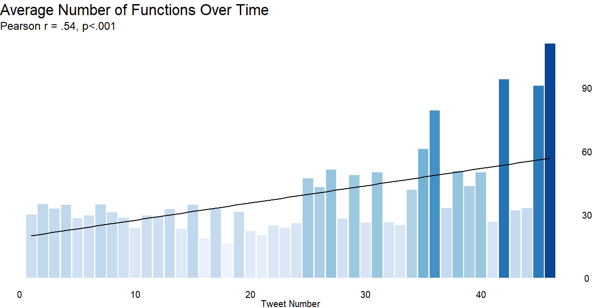
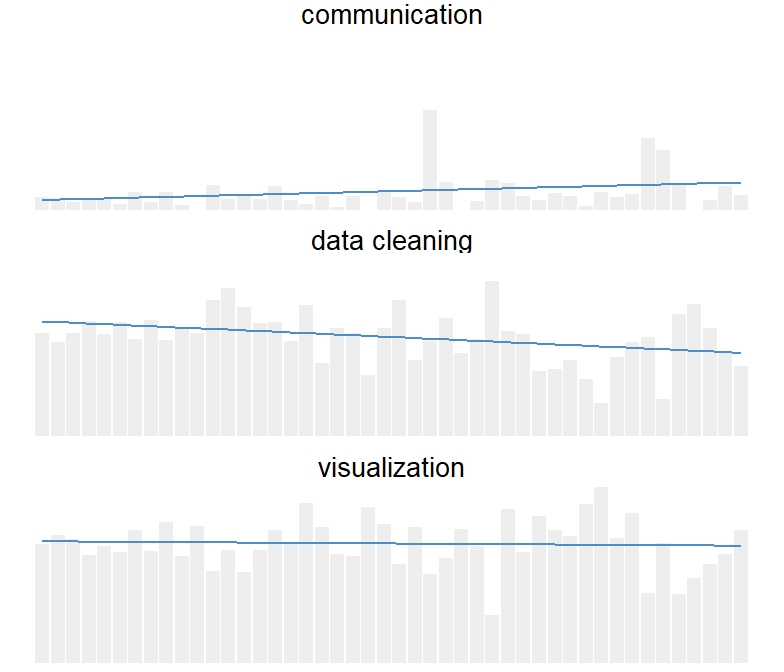
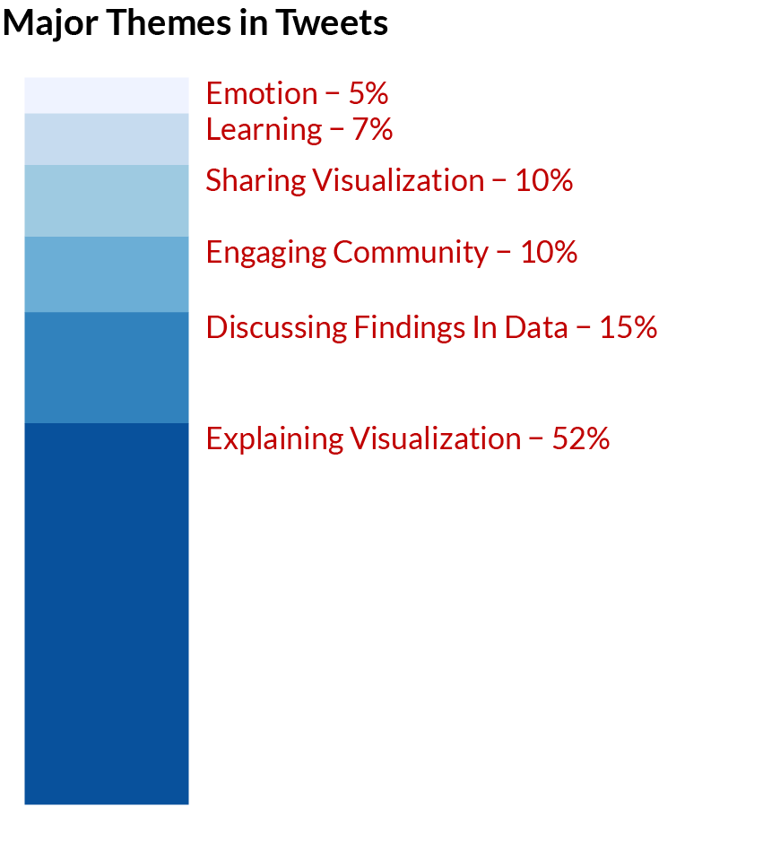
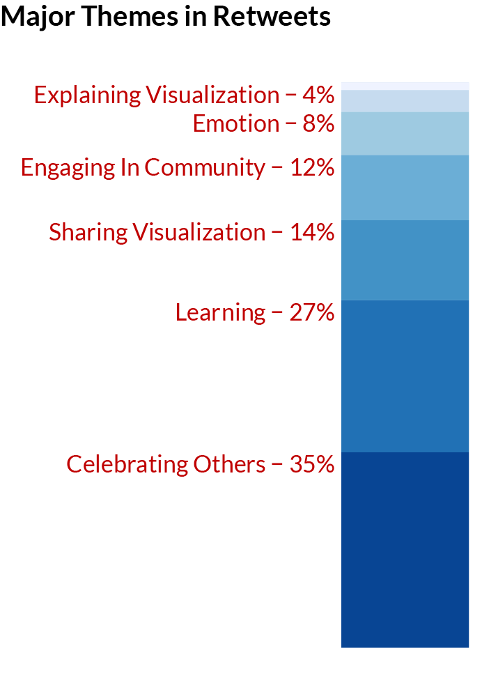

#### [Download the poster here!](tidy_tuesday_poster.pdf)
This poster was designed using the #betterposter format. [Click here to learn more.](https://twitter.com/mikemorrison/status/1110191245035479041?lang=en)

## Communities of Practice

Communities of practice (CoPs) are groups of people who share a common interest and participate in activities that promote learning. Originally face-to-face, the internet has ushered in many new platforms for CoPs. Twitter hashtags act as virtual homes for many. The #TidyTuesday hashtag serves as a community for those interested in data science and visualization. It involves weekly visualization challenges utilizing public data sets and the R programming language. Users contribute graphics and code to share their work and also as opportunities to learn from one another. As the importance of data science grows, the #TidyTuesday CoP is a promising context for the exploration of learning in online communities and of how individuals develop capabilities regarding visualization and programming.

## #TidyTuesday

Every Tuesday, a unique data set is posted on Twitter using the hashtag #TidyTuesday. Participants use the data set to create visualizations using R programming language and the Tidyverse packages. Participants then share their visualization on Twitter and link to their code (on Github).  This is done not only to share their own work, but as chances to learn from each other. It is open to contributors of any skill level.

### #TidyTuesday Examples

<a href="https://twitter.com/ariamsita/status/1171421023838687232?ref_src=twsrc%5Etfw%7Ctwcamp%5Etweetembed%7Ctwterm%5E1171421023838687232&ref_url=https%3A%2F%2Fnsgrantham.shinyapps.io%2Ftidytuesdayrocks%2F" target="_blank">
</a>

<a href="https://twitter.com/jakekaupp/status/1161656332686102529?ref_src=twsrc%5Etfw%7Ctwcamp%5Etweetembed%7Ctwterm%5E1161656332686102529&ref_url=https%3A%2F%2Fnsgrantham.shinyapps.io%2Ftidytuesdayrocks%2F" target="_blank">
</a>

<a href="https://twitter.com/geokaramanis/status/1164147090580267008?ref_src=twsrc%5Etfw%7Ctwcamp%5Etweetembed%7Ctwterm%5E1164500880177188864&ref_url=https%3A%2F%2Fnsgrantham.shinyapps.io%2Ftidytuesdayrocks%2F" target="_blank">
</a>


### What is R?

R is a statistical programming language that is used for data analysis, modeling, machine learning, and data visualization. It has been around for over 20 years and has become a sought after programming language in data analysis, statistics, business analytics, and other fields. Below is an example of simple R code and a simple plot produced with this code.

```{r, message=FALSE, warning=FALSE}
library(tidyverse)
library(ggplot2)

iris %>%
  ggplot() +
	geom_point(aes(x=Sepal.Length,y=Sepal.Width))
```


## Research Purpose

  The current research represents an exploratory project that examines one year of #TidyTuesday tweets through descriptive statistics, content analyses using the `TidyCode` package, and qualitative coding in order to understand the activities and potential impacts of the #TidyTuesday CoP. It examines who contributes, the content of their tweets, the makeup of their code, and how their code changes over time.
  
## Findings

Data was pulled from [TidyTuesday Rocks](https://nsgrantham.shinyapps.io/tidytuesdayrocks/), an interactive app that allows you to explore TidyTuesday contributions.

### Descriptives

There were **4,418** tweets contributed to the data set.

There were **2,428** unique contributions to the data set.
* A contribution is any post that included an image.

There were **800** unique contributors.
* Contributors are those who tweeted some image during #TidyTuesday

There were **46.7** mean contributions per week.

Each user contributed an average of **5.93** times in one year.


### Content Analysis

Along with their graphic visualizations, many contributors also share their code via Github. This allows others to reproduce contributors' work, possibly aiding in data visualization skill development.

Code from contributors' Github repositories were scraped and subsequently analyzed using the [`TidyCode`](https://cran.r-project.org/web/packages/tidycode/index.html) package. This package allows individual functions to be classified according to a crowd-sourced dictionary of R functions. These classifications include setup, import, export, data cleaning (encompassing data wrangling and munging), visualization, communication, modeling, exploration, and evaluation. The dictionary was modified to include non-classified functions and to reclassify functions based on the content of data visualization. 

#### Functions Over Time

First, the average number of functions were tweet number was analyzed. Tweet number represents each users unique contribution for that week. The analysis showed that over time the mean number of functions increase. This could suggest writing longer and more complex code, especially code that includes a larger variety of functions. A simple Pearson correlation between mean functions and tweet number also suggested that as tweet numbers increase, so do mean functions (*r* = .54, *p* < .001 - a medium correlation).


  
#### Change in Function Proportion

An analysis of the proportion of functions by classification per week was also analyzed. This analysis focused on data cleaning, data visualization, and data communication. It showed that, while proportion fluctuates;

* **communication** related functions are slowly increasing.
  + Communication functions are those that add a more textual, communicative layer to visualizations.
  + These functions include `geom_label(), geom_curve(), str_wrap(), arrow()`


* **data cleaning** actually decreased over time, suggesting less pre-processing of data and the possibility of writing more efficient code that uses less functions.
  + These functions include `mutate(), filter(), case_when()` and a variety of `join()` functions


* **visualization** functions remain relatively stable over time
  + These include functions like `theme(), geom_path(), aes(), facet_wrap()`
  


### Qualitative Coding

#### Tweets
  
150 random tweets (initial contributions) were samples from the data and coded. These codes were then used to reveal several themes in the tweets.

It was found that a majority of tweets were visualization focused, either explaining the visualizations themselves (how they were made, what they looked at) or discussing interesting findings in the data.

{width=300px}

Some examples:

```{r, echo=FALSE, warning=FALSE}
library(knitr)

explain <- data.frame(`Theme`="Explaining Data",
                      `Example`="#TidyTuesday turned into tidy Saturday this week! Looking at plastic pollution around the globe. I made a waffle chart of the five countries with most mismanaged plastic waste.")
discuss <- data.frame(`Theme`="Discussing Findings",
                      `Example`="#tidytuesday I used to think all nobel peace price winners are grey old guys. Turns out, they are getting younger compared to the other folks.")
engage <- data.frame(`Theme`="Engaging Community",
                      `Example`="My #tidytuesday viz this week is inspired by awesome people who make scarves from data. Can't knit, but I can geom_linerange")
emotion <- data.frame(`Theme`="Showing Emotion",
                      `Example`="First ever #TidyTuesday submission! I've always been reluctant to share, because I see so many great submissions. But today I've done some new cool things (first time I made a map in R!!) and I'm quite happy with the result.")
tweet<-rbind(explain, discuss, engage, emotion)

tweet %>% kable()
```

#### Retweets
Likewise, 150 randomly sampled retweets were coded. Retweets were chosen as they can reveal how users are not only contributing to the #TidyTuesday challenge itself but how they are engaging with the community. Most retweets were simply promoting #TidyTuesday (e.g. "It's #TidyTuesday yall!")and these were removed from analysis as they were not seen as substantive. More substantive tweet content was found to mostly be about celebrating others' work, related to their own learning via the community, or sharing the work of others.

{width=300px}


```{r, echo=FALSE, warning=FALSE}
library(knitr)

celebrate <- data.frame(`Theme`="Celebrating Others",
                      `Example`="Jake's dataviz work as part of #TidyTuesday is always beautiful. This one is especially great. Check out the legend he made using ggplot.")
learning <- data.frame(`Theme`="Learning",
                      `Example`="Thanks to #TidyTuesday for making it so easy to learn/use #R and to get to know others! #grateful")
share <- data.frame(`Theme`="Sharing Others' Visualizations",
                      `Example`="This thread highlights one of my favorite parts of #TidyTuesday, spontaneous and friendly collaboration!! Sara continues to do awesome deep dives on the #tidytuesday datasets! Lots of great content here and on her GitHub.")

retweet<-rbind(celebrate, learning, share)

retweet %>% kable()
```


## Conclusion

This preliminary research has education-related implications for those involved in data science. It suggests that participating in #TidyTuesday can help one develop their data visualization skills by learning from others' visuals and code and by exercising one's own skills. It also indicates that sustained participation can help increase the complexity of one's code, the efficiency of one's code, and the graphics produced may contain enhanced communicative ability.

Further research will be used to verify and enhance these claims.
  
